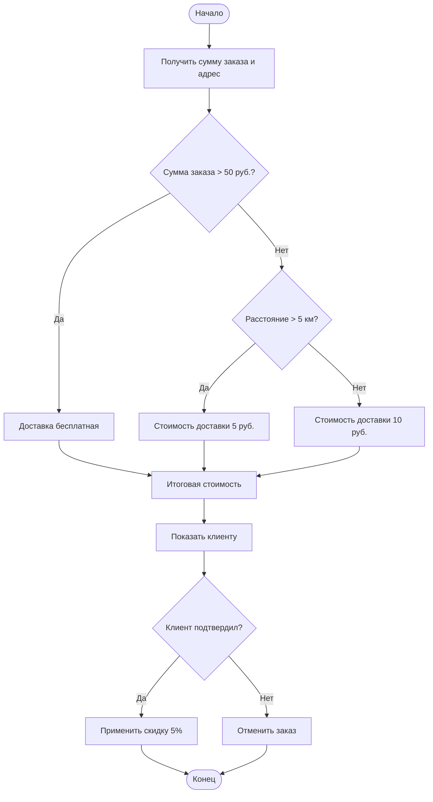

```mermaid
flowchart TD
    A([Начало]) --> B[Получить сумму заказа и адрес]
    B --> C{Сумма заказа > 50 руб.?}
    C --> |Да| D[Доставка бесплатная]
    C --> |Нет| E{Расстояние > 5 км?}
    E --> |Да| F[Стоимость доставки 5 руб.]
    E --> |Нет| G[Стоимость доставки 10 руб.]
    D --> H[Итоговая стоимость]
    F --> H
    G --> H
    H --> I[Показать клиенту]
    I --> K{Клиент подтвердил?}
    K --> |Да| L[Применить скидку 5%]
    K --> |Нет| M[Отменить заказ]
    L --> J([Конец])
    M --> J
```