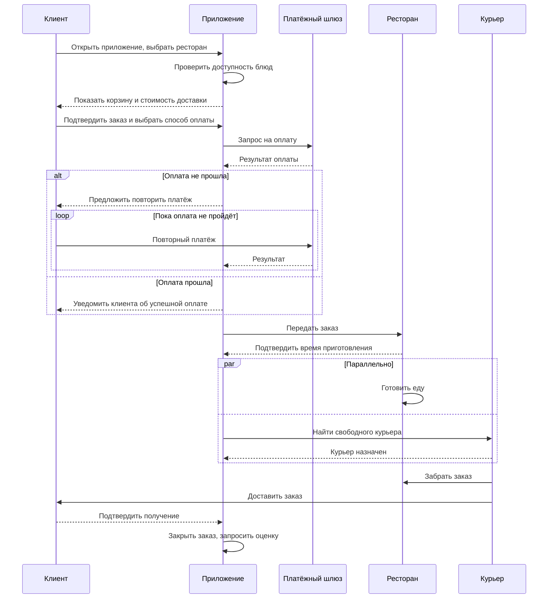

```mermaid
sequenceDiagram
    participant C as Клиент
    participant A as Приложение
    participant PG as Платёжный шлюз
    participant R as Ресторан
    participant CR as Курьер

    C->>A: Открыть приложение, выбрать ресторан
    A->>A: Проверить доступность блюд
    A-->>C: Показать корзину и стоимость доставки
    C->>A: Подтвердить заказ и выбрать способ оплаты
    A->>PG: Запрос на оплату
    PG-->>A: Результат оплаты

    alt Оплата не прошла
        A-->>C: Предложить повторить платёж
        loop Пока оплата не пройдёт
            C->>PG: Повторный платёж
            PG-->>A: Результат
        end
    else Оплата прошла
        A-->>C: Уведомить клиента об успешной оплате
    end

    A->>R: Передать заказ
    R-->>A: Подтвердить время приготовления

    par Параллельно
        R->>R: Готовить еду
        and
        A->>CR: Найти свободного курьера
        CR-->>A: Курьер назначен
    end

    CR->>R: Забрать заказ
    CR->>C: Доставить заказ
    C-->>A: Подтвердить получение
    A->>A: Закрыть заказ, запросить оценку
```