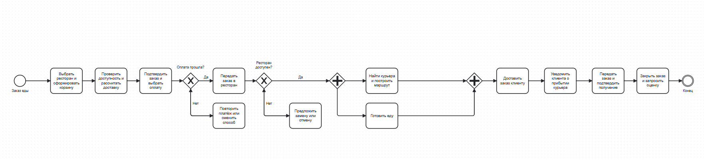
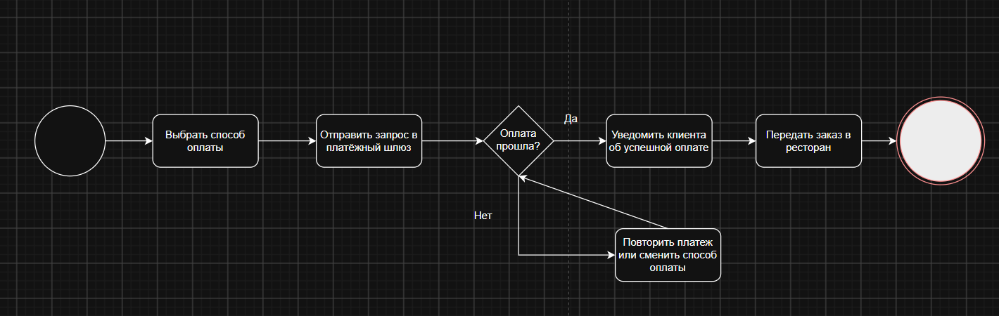
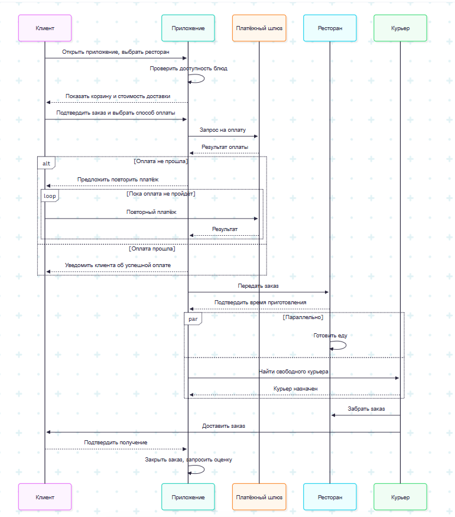
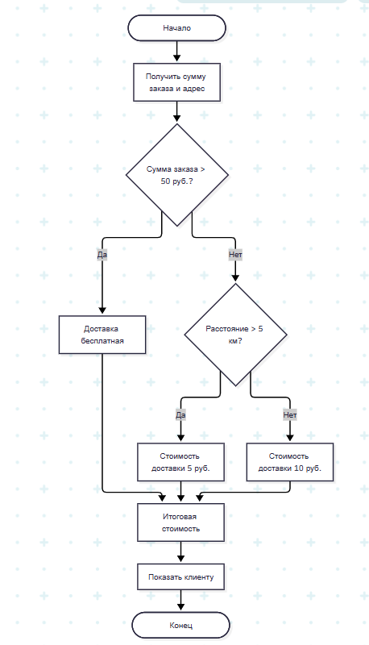

# Лабораторная работа №1

## Краткое описание процесса
Клиент через приложение выбирает ресторан, формирует корзину и подтверждает заказ. Система проверяет доступность блюд, рассчитывает стоимость доставки и через платёжный шлюз обрабатывает оплату. При неудачной оплате клиенту предлагается повторить платёж или сменить способ; при успешной — заказ передаётся в ресторан. Ресторан подтверждает заказ и время приготовления; если он недоступен или блюдо закончилось, система предлагает замену или отмену. Параллельно кухня готовит еду, а система ищет курьера и строит маршрут. Курьер забирает заказ и доставляет его клиенту, который отслеживает статус в реальном времени. По прибытии клиент подтверждает получение, после чего система закрывает заказ, сохраняет данные и запрашивает оценку.
## Ссылки на диаграммы

### 1. BPMN диаграмма

### 2. UML Activity диаграмма

### 3. Sequence диаграмма
 

### 4. Flowchart диаграмма

## Diffs
 
 
 
 
 
 
 
 
 
 
 
 
 

## Вывод
В ходе лабораторной работы я научился создавать диаграммы в четырёх разных стилях: BPMN, UML Activity, Sequence и Flowchart. Я также настроил свой первый репозиторий на GitHub. Еще для себя узнал, что диаграммы можно хранить прямо в виде текста через Mermaid и просматривать их на GitHub. В целом я разобрался, как описывать бизнес-процессы разными способами и сохранять все изменения в репозитории.
